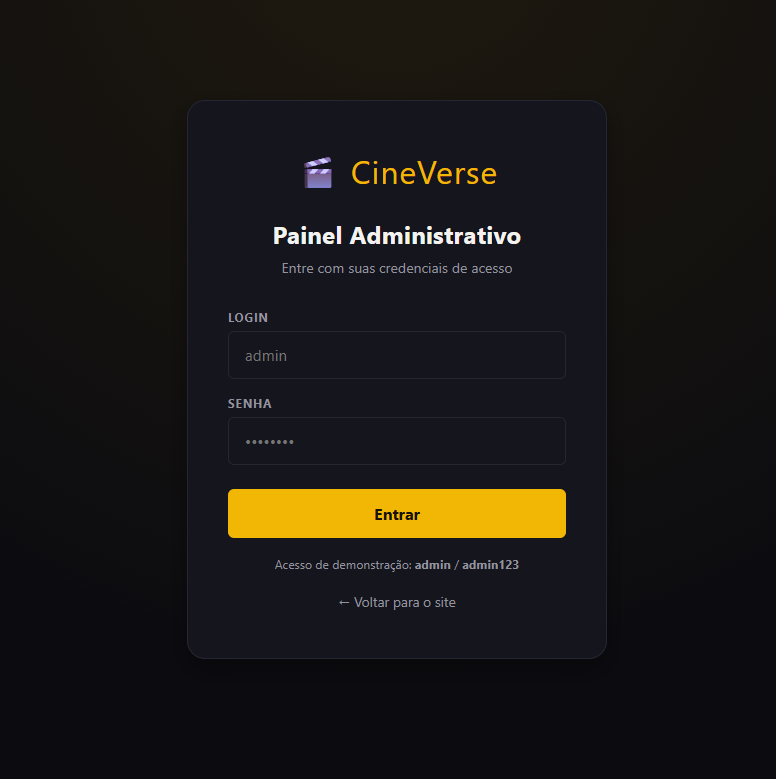
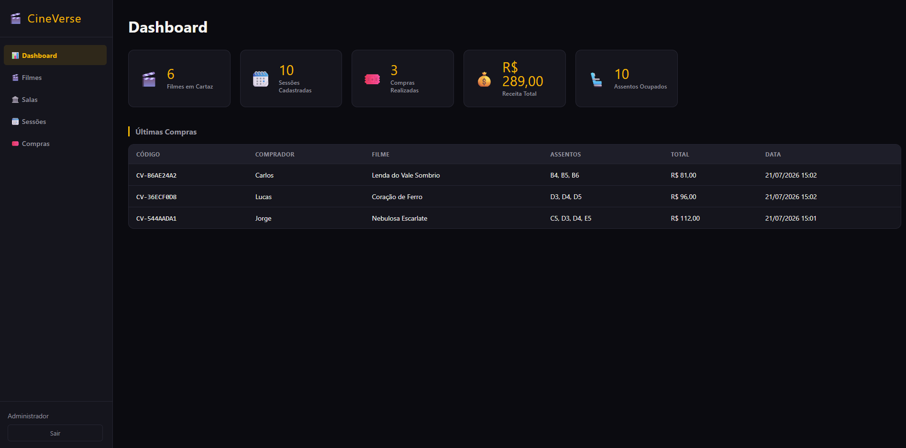
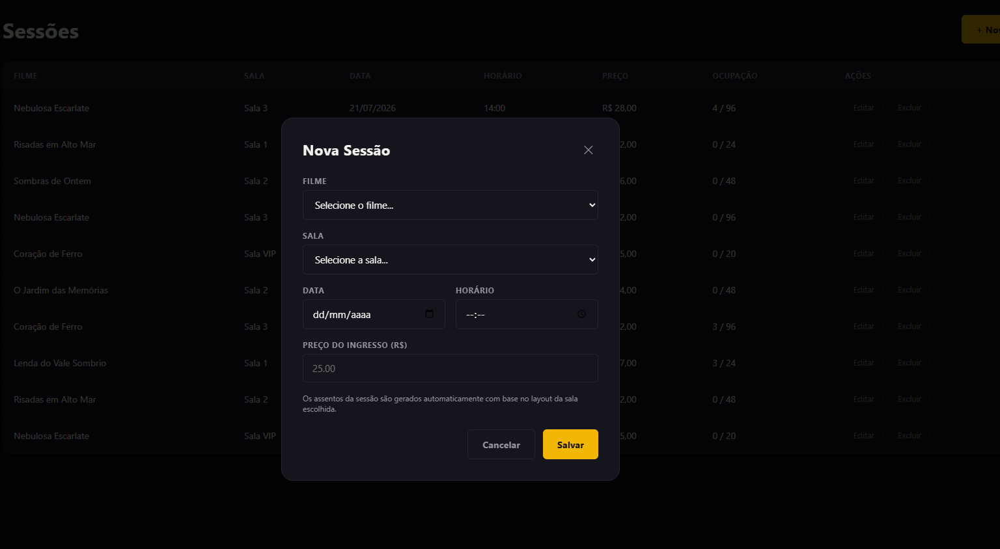
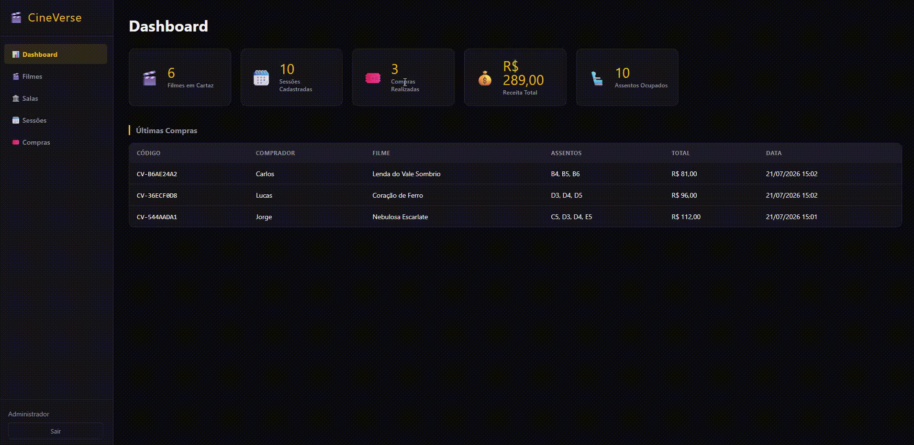

# 🎬 CineVerse — Sistema de Gerenciamento de Cinema

<p align="center">
  
</p>

<p align="center">
Sistema Full Stack desenvolvido com <strong>Java + Spring Boot + HTML + CSS + JavaScript</strong>.
</p>

<p align="center">


</p>

---

# 📖 Sobre

O **CineVerse** é uma aplicação web para gerenciamento de cinemas. Permite consultar filmes, visualizar sessões, reservar assentos e administrar filmes, salas e sessões através de um painel administrativo.

O projeto foi desenvolvido para fins de estudo e portfólio, utilizando arquitetura em camadas com Spring Boot no back-end e HTML, CSS e JavaScript puro no front-end.

---

# 📚 Índice

- Funcionalidades
- Tecnologias
- Arquitetura
- Estrutura
- Como executar
- Contas de acesso
- Screenshots
- Roadmap
- Autor

---

# ✨ Funcionalidades

## Cliente

- Login
- Consulta de filmes
- Visualização de sessões
- Escolha de assentos
- Compra de ingressos

## Administrador

- Dashboard
- Cadastro de filmes
- Cadastro de salas
- Cadastro de sessões
- Gerenciamento de compras

---

# 🛠 Tecnologias

| Tecnologia | Uso |
|------------|-----|
| Java 21 | Backend |
| Spring Boot | API REST |
| HTML5 | Interface |
| CSS3 | Estilização |
| JavaScript | Front-end |
| Maven | Build |

---

# 🏗 Arquitetura

```text
Frontend
   │
REST API
   │
Controllers
   │
Services
   │
Repositories
   │
Dados em memória
```

---

# 📂 Estrutura

```text
cineverse/
├── backend/
├── frontend/
├── docs/
└── README
      └──images/
      └── README.md
```

---

# 🚀 Como executar

## Backend

```bash
cd backend
mvn spring-boot:run
```

API disponível em:

```
http://localhost:8080
```

Dados iniciais:

- 6 filmes
- 4 salas
- 10 sessões
- Usuário administrador

Persistência em memória.

## Frontend

```bash
cd frontend
npx serve .
```

ou

```bash
python -m http.server 5500
```

Abra:

```
http://localhost:5500
```

Caso altere a porta da API, ajuste `API_URL` em `frontend/js/utils.js`.

---

# 🔑 Conta padrão

| Login | Senha |
|-------|-------|
| admin | admin123 |

---

# 📸 Screenshots

Adicione imagens em:


# 📸 Screenshots

| Página Inicial                           | Login                                     |
|------------------------------------------|-------------------------------------------|
|  |  |

| Painel Administrativo                     | Cadastro de Filmes |
|-------------------------------------------|--------------------|
|  |  |


---

# 🎥 Demonstração

GIFs:


| Página Inicial                          | Login                                    |
|-----------------------------------------|------------------------------------------|
|  |  |

| Painel Administrativo                    | Compra de Ingressos                       |
|------------------------------------------|-------------------------------------------|
|  |  |


---

# 🗺 Roadmap

- [x] Login
- [x] Filmes
- [x] Sessões
- [x] Salas
- [x] Painel administrativo
- [ ] MySQL
- [ ] Docker
- [ ] Deploy
- [ ] JWT
- [ ] Testes automatizados

---

# 👨‍💻 Autor

**Victor Hugo Dainez Wolfman**

GitHub: https://github.com/SEU-USUARIO

LinkedIn: https://linkedin.com/in/SEU-PERFIL

---

## ⭐ Se este projeto foi útil, deixe uma estrela no repositório!
